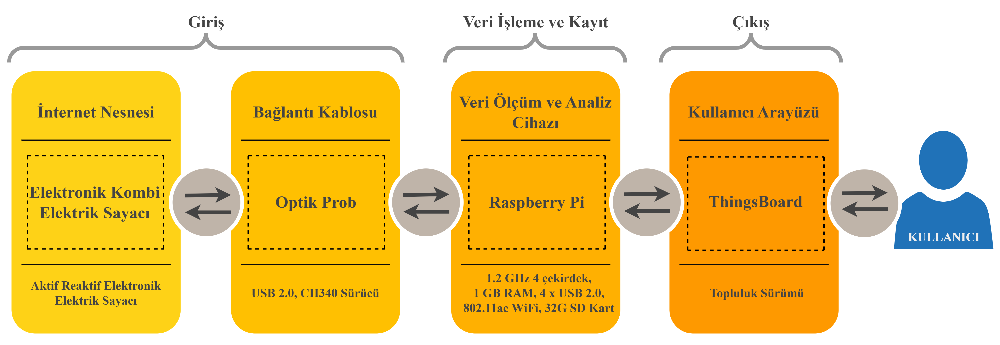
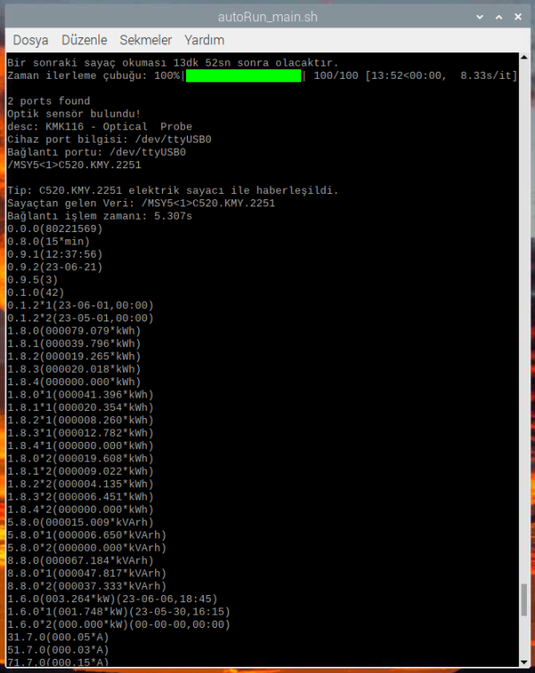
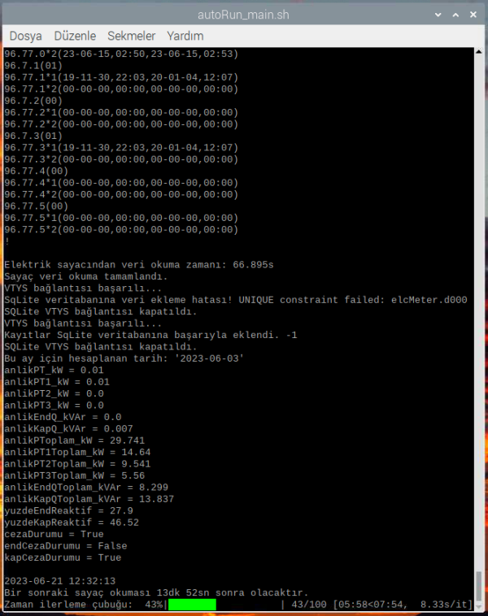
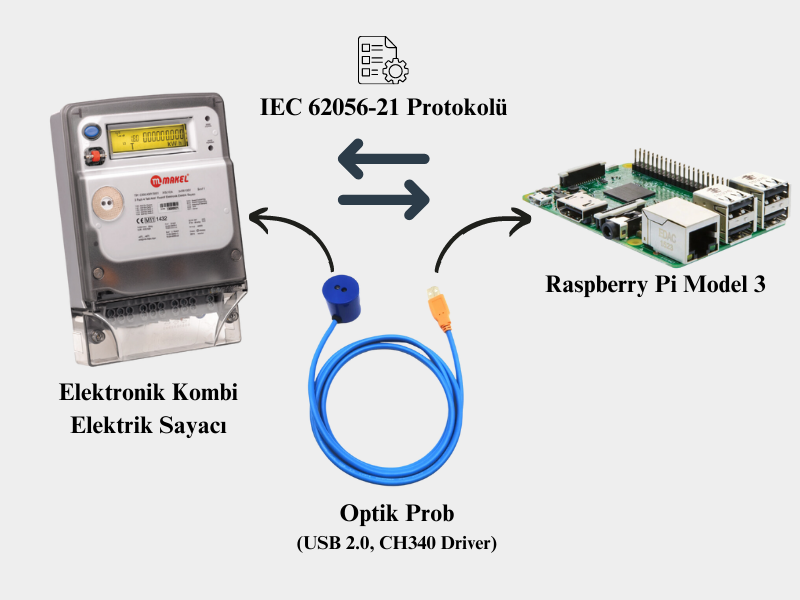
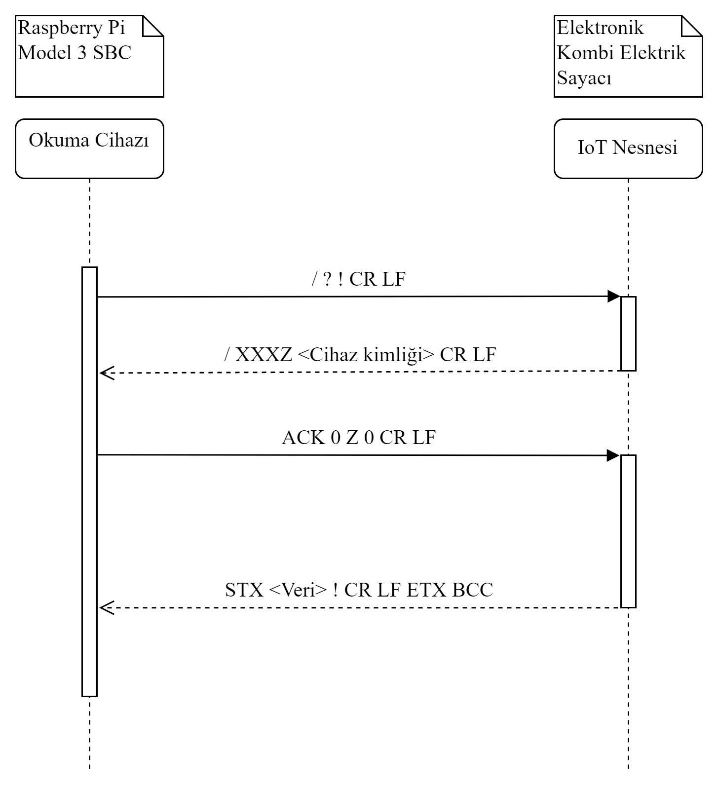
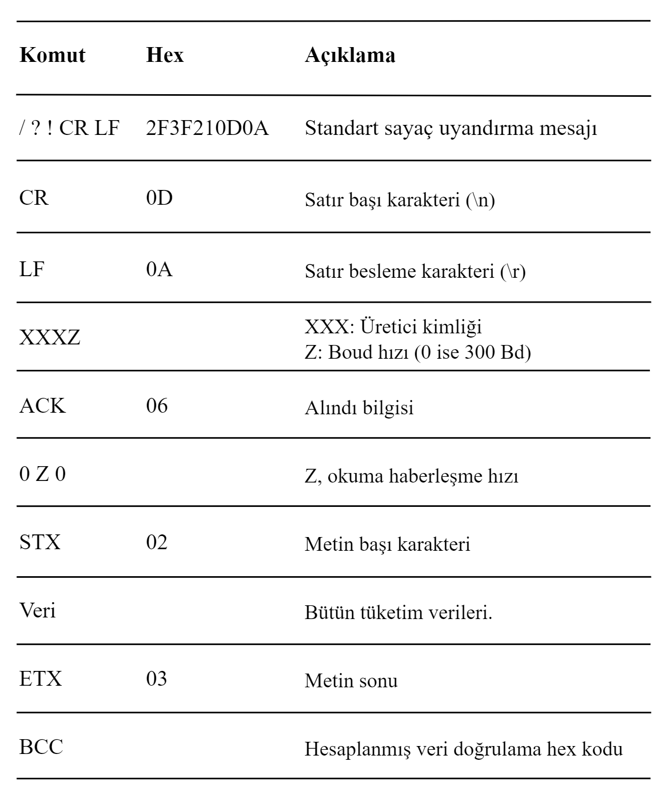
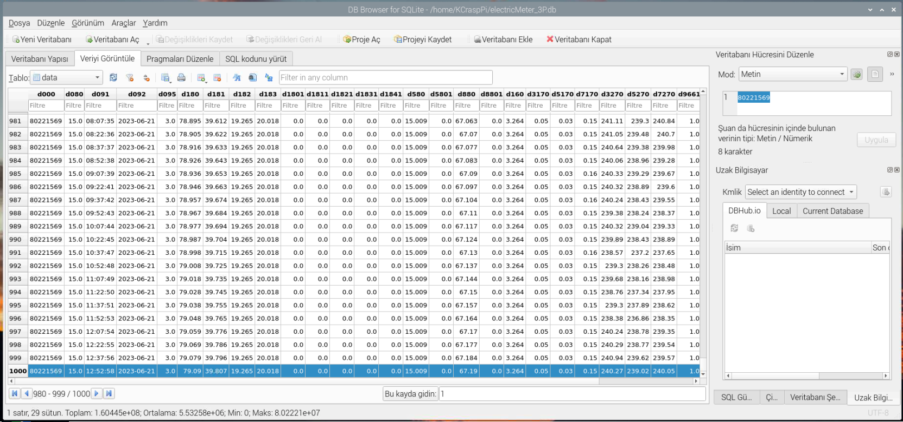
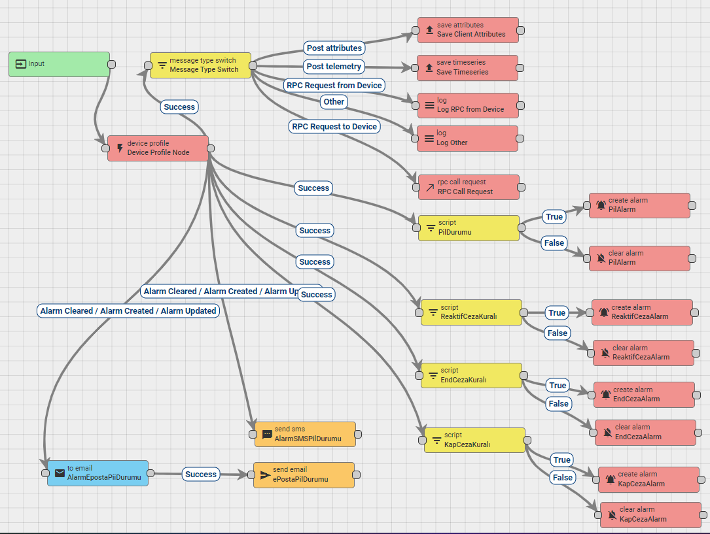
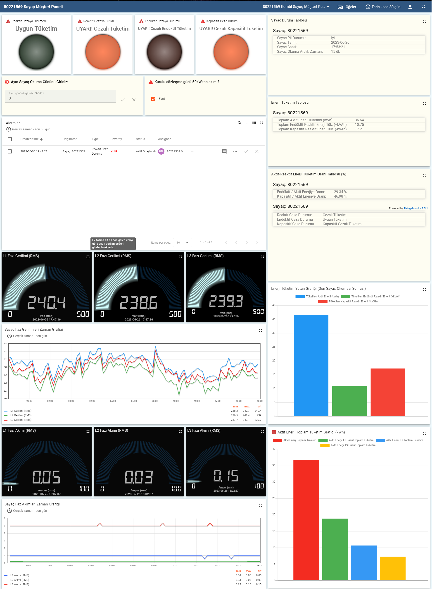
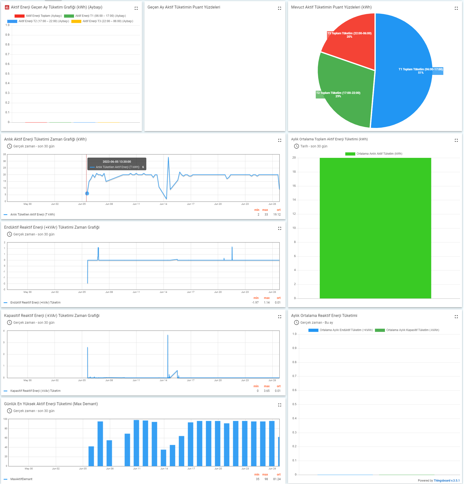

# elc-meter-reader
Bu projede üç fazlı aktif-reaktif (kombi) elektronik elektrik sayaçlarından belli periyotlarla alınan verileri IoT çözüm platformu olan [ThingsBoard](https://thingsboard.io/) üzerinden kullanıcılara görsel veri ve analizler gösterilmesi amaçlanmıştır. Ayrıca hazırlanan demo yazılım içerisinde bir fazlı aktif elektronik elektrik sayaçlarından okuma yapılmasını sağlayan modül de eklenmiştir.

## İçindekiler
* [elc-meter-reader](#elc-meter-reader)
  * [Hakkında](#hakkında)
  * [Gereksinimler](#gereksinimler)
  * [Kurulum](#kurulum)
  * [Kullanım](#kullanım)
  * [Kural Motoru](#kural-motoru)
  * [İletişim](#İletişim)

## Hakkında
Bu çalışmada elektrik sayaç verileri IEC 62056-21 standardı Mod C protokolüne ile okuması gerçekleştirilmiştir. Sayaç okuma verileri [Raspberry Pi](https://www.raspberrypi.com/) üzerinde koşan [SQLite3](https://www.sqlite.org/) veritabanı yönetim sistemine kayıt edilmektedir. Üç fazlı elektronik kombi sayaçlar ve bir fazlı elektronik elektrik sayaçları için ayrı bir vertabanı yönetim sistemi oluşturulmuştur. Hangi türden sayaç kullanılacak ise [main.py](./main.py)'de sayaç türü belirtilmesi ([bkz.](#kurulum)) diğer modüllerin yüklenmesini tetikleyecektir.
Kullanılan yönteme ait 

## Gereksinimler
| Derleyici | Sürüm |
| :- | :-: |
| [Python](https://www.python.org/downloads/) | `3.9+` |

| Kütüphane | Sürüm |
| :- | :-: |
| [pip](https://pypi.org/project/pip/) | `21.3+` |
| [pySerial](https://pypi.org/project/pyserial/3.5/) | `3.5` |
| [Requests](https://pypi.org/project/requests/) | `2.31+` |
| [tqdm](https://pypi.org/project/tqdm/) | `4.64.1` |

## Kurulum
Projenin bulunduğu konumda bir terminal oluşturup aşağıdaki komut ile gerekli kütüphaneleri yükleyin.
```shell
python -m pip install -U -r requirements.txt
```
Daha sonra [main.py](./main.py) dosyasındaki "[METER_PHASE_TYPE](./main.py#L26)" değişkenine sayaç bir fazlı ise 1, üç fazlı ise 3 ataması yapılması yeterlidir.

## Kullanım
Raspbian işletim sistemi içerisinde LX konsol uygulası olan program Python dili ile yazılmıştır. [main.py](./main.py) python3 ile çalıştırıldığında bir okuma döngüsü sonrası konsol ekranında görünen çıktı aşağıda görülmektedir.
 ve 

## Donanım Bağlantısı
Elektirik sayacı ile Raspberry Pi arasındaki bağlantı:


## Sayaç Veri Okuması
Elektrik sayacından IEC 62056-21 standardı Mod C protokolüne ile okumasına ait  ve 
Elektronik elektrik sayacından okunan anlık veriler olası durumlarda incelenmek üzere  üzerine yazılmaktadır. Ayrıca okunan anlık veriler SQLite3 veritabanı yönetim sistemine kayıt olarak depolanmaktadır. Kayıt olarka eklenen verilere ait ekran görüntüsü:


## Kural Motoru
Üç fazlı sayaç için oluşturulmuş kural motoru:

Endüktif veya kapasitif uygunsuz tüketim gerçekleştiğinde alarm vermektedir.

## Örnek Görsel Arayüz
Web sayfası arayüzüne ait HIPO diyagramı:


Sunum katmanı arayüzü:

 

## İletişim
koray.cn@hotmail.com
