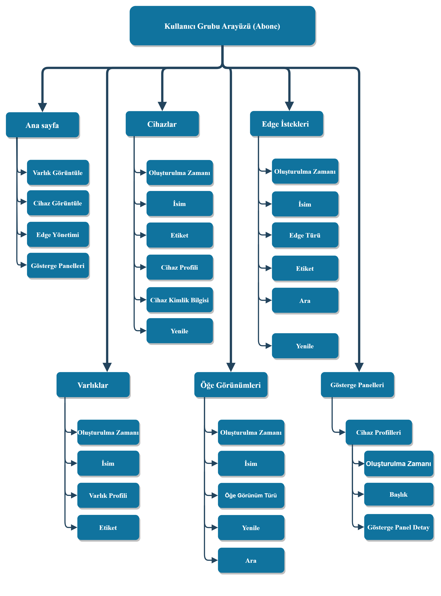

# elc-meter-reader
Bu projede elektronik elektrik sayaçlarından belli periyotlarla alınan verileri IoT çözüm platformu olan [ThingsBoard](https://thingsboard.io/) üzerinden kullanıcılara görsel veri ve analizler gösterilmesi amaçlanmıştır.

## İçindekiler
* [elc-meter-reader](#elc-meter-reader)
  * [Hakkında](#hakkında)
  * [Gereksinimler](#gereksinimler)
  * [Kurulum](#kurulum)
  * [Kullanım](#kullanım)
  * [Kural Motoru](#kural-motoru)
  * [İletişim](#İletişim)

## Hakkında
Sayaç okuma verileri [Raspberry Pi](https://www.raspberrypi.com/) üzerinde koşan [SQLite3](https://www.sqlite.org/) veri tabanına kayıt edilmektedir. Üç fazlı elektronik kombi sayaçlar ve bir fazlı elektronik elektrik sayaçları için ayrı bir veri tabanı oluşturmaktadır. Hangi türden sayaç kullanılacak ise [main.py](./main.py)'de sayaç türü belirtilmesi ([bkz.](#kurulum)) diğer modüllerin yüklenmesini tetikleyecektir.

## Gereksinimler
| Derleyici | Sürüm |
| :- | :-: |
| [Python](https://www.python.org/downloads/) | `3.9+` |

| Kütüphane | Sürüm |
| :- | :-: |
| [pip](https://pypi.org/project/pip/) | `21.3+` |
| [pySerial](https://pypi.org/project/pyserial/3.5/) | `3.5` |
| [Requests](https://pypi.org/project/requests/) | `2.31+` |
| [tqdm](https://pypi.org/project/tqdm/) | `4.64.1` |

## Kurulum
Projenin bulunduğu konumda bir terminal oluşturup aşağıdaki komut ile gerekli kütüphaneleri yükleyin.
```shell
python -m pip install -U -r requirements.txt
```
Daha sonra [main.py](./main.py) dosyasındaki "[METER_PHASE_TYPE](./main.py#L26)" değişkenine sayaç bir fazlı ise 1, üç fazlı ise 3 ataması yapılması yeterlidir.

## Kullanım
Kullanım

## Kural Motoru
Üç fazlı sayaç için oluşturulmuş kural motoru:

Endüktif veya kapasitif uygunsuz tüketim gerçekleştiğinde alarm vermektedir.

## Örnek Görsel Arayüz


## İletişim
koray.cn@hotmail.com
